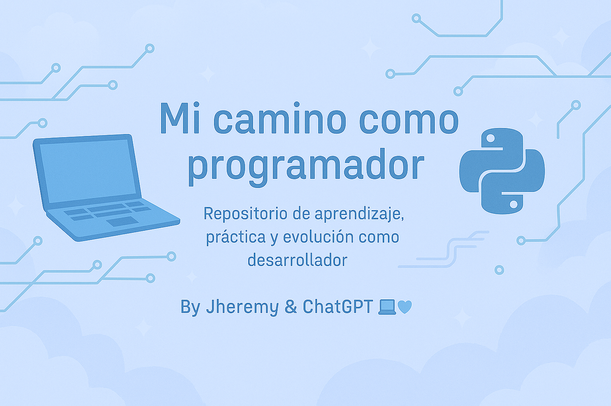

# 🚀 Mi Camino como Programador

👋 ¡Hola! Soy **Jheremy**, estudiante de Ingeniería Informática en la UAX 🇪🇸  
Este repositorio es mi espacio de práctica, estudio y crecimiento.  
Aquí voy documentando todo lo que aprendo mientras me preparo para la universidad  
y para lograr mi primer trabajo como desarrollador 🧑‍💻💙
Estoy aprendiendo desde cero, practicando Python 🐍 y soñando con ser Backend Dev 💻✨

---

## 🎯 Objetivos del Repositorio

✅ Aprender Python paso a paso  
✅ Desarrollar la lógica de programación  
✅ Organizar mis avances por niveles  
✅ Crear mi portafolio profesional  
✅ Compartir mi proceso de forma transparente y real  

---

## 🧠 Avances por Niveles

| Nivel    | Estado        | Contenido Clave                                  |
|----------|---------------|--------------------------------------------------|
| Nivel 1  | ✅ Completado  | Fundamentos: `print()`, tipos de datos, `input()`, concatenación |
| Nivel 2  | ✅ Completado  | Operaciones, comparaciones, `type()`, lógica booleana |
| Nivel 3  | ✅ Completado  | Condicionales `if`, `elif`, `else`, validaciones |
| Nivel 4  | 🔄 En progreso | Bucles `for`, `while`, listas, repetición y práctica |

---

## 📁 Estructura del Repositorio

Cada carpeta incluye los ejercicios realizados y explicaciones con comentarios 📝
junto con archivos PDF que les puede servir para realizar los retos que hice. 😊
---

## 🧾 ¿Qué encontrarás aquí?

📚 **Ejercicios prácticos**: organizados por niveles (variables, condicionales, listas, bucles, etc.)  
📦 **Proyectos pequeños** que surjan durante mi formación  
🎯 **Notas explicativas** y mis razonamientos sobre cada reto  
📘 **Cuaderno de progreso** tipo diario de aprendizaje digital  
🧩 **Ejercicios del curso de Python desde cero de MoureDev**

---

## 🎓 Curso: Python Desde Cero – by MoureDev

Estoy haciendo el curso en mouredevpro de [Python desde cero 🐍](https://campus.mouredev.pro/enrollments) y comparto mi avance, ejercicios y apuntes en esta carpeta:

📂 [`/Python_Desde_Cero_(Curso)`](https://github.com/jhervs/mi_camino_como_programador/tree/main/Python_Desde_Cero_(Curso))  
Allí subo los retos propuestos, mis soluciones y reflexiones. Cada avance está comentado y versionado 📝

## 🛠️ Tecnologías que estoy usando

- 🐍 Python (principal lenguaje de práctica)
- 💻 Visual Studio Code
- 📄 Google Docs (para mi cuaderno digital)
- 🌐 GitHub (portafolio y control de versiones)

---

## 🌟 Frase motivadora

> _“Cada línea de código que escribo es una semilla de mi futuro como desarrollador.”_  
> **By Jheremy & ChatGPT 💻🩵**

---

## 📫 Conectemos

- 🌍 Actualmente: Madrid, España
- 🎓 Estudiante en la UAX
- 📧 Contacto: *[jheremy81945@gmail.com]*  
- 📌 Portafolio: *En construcción...*

---

✨ ¡Gracias por acompañarme en este camino!  
Este repositorio es mi forma de compartir que **todos podemos aprender a programar**, paso a paso y con amor por el proceso 🌱💙

